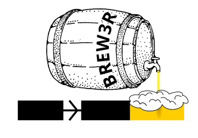
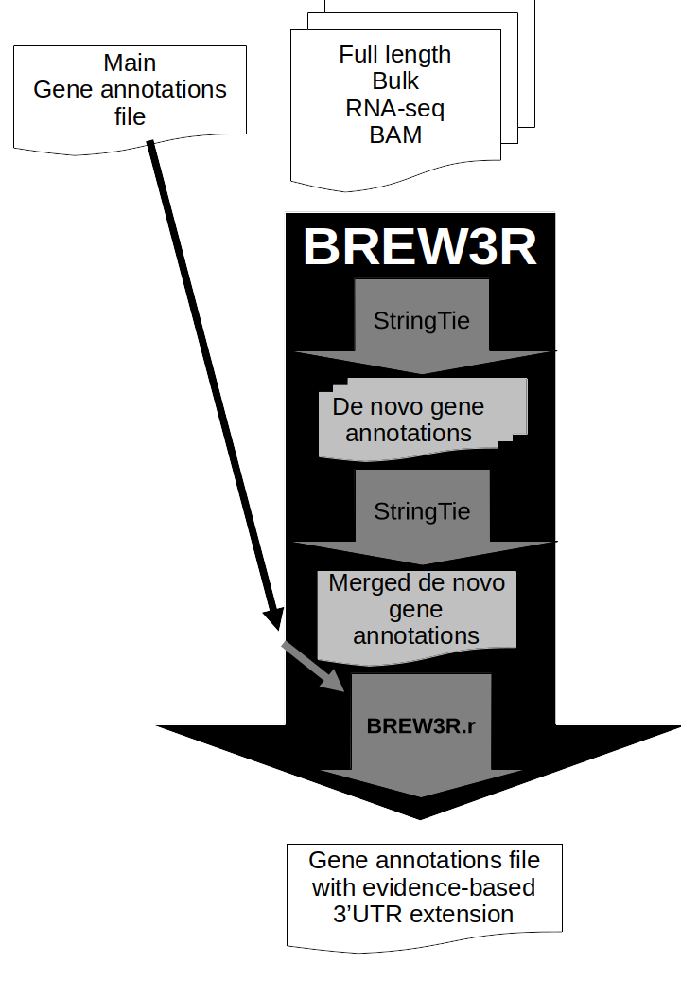

# BREW3R

BREW3R stands for **B**ulk **R**NA-seq **E**vidence-based **W**orkflow for **3**' UTR **R**eannotation. 

This workflow enables extending an existing gtf downloaded on a public website, like Ensembl, Genecode or UCSC, using *de novo* gene annotation with StringTie on full length bulk RNA-seq.

BREW3R highly relies on a R package called BREW3R.r available on [bioconductor](https://bioconductor.org/packages/release/bioc/html/BREW3R.r.html).

Here is a schema of the workflow:

All dependencies of BREW3R have been installed into a [docker container](https://hub.docker.com/r/lldelisle/brew3r).

If you want to run BREW3R, you can use [Galaxy](https://dockstore.org/workflows/github.com/iwc-workflows/brew3r/main:main?tab=info) or the sbatch scripts available in the [slurm](./slurm/) directory.
